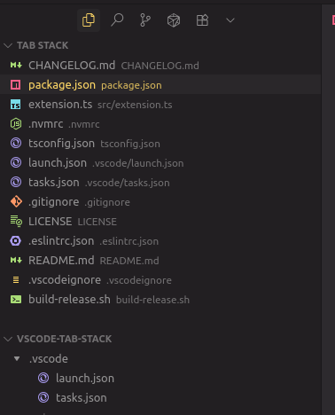

# Tab Stack

A VS Code extension for managing editor tabs with a focus-based view.



## Features

- **Recent Tabs View**: See all your open tabs across all splits, ordered from most recently focused to least recently focused
- **Quick Navigation**: Click any tab in the view to instantly switch to it
- **Real-time Updates**: The tab list automatically updates as you open, close, or switch between tabs
- **Cross-Split Awareness**: Shows tabs from all editor splits in one unified view

## Usage

1. After installing the extension, look for the "Tab Stack" icon in the Activity Bar (left sidebar)
2. Click it to open the Tab Stack view
3. Your open tabs will be listed with the most recently focused at the top
4. Click any tab to switch to it
5. Use the refresh button in the view title bar to manually refresh the list

## Development

1. Install dependencies: `npm install`
2. Compile the extension: `npm run compile`
3. Press F5 to open a new window with the extension loaded
4. Look for the "Tab Stack" icon in the Activity Bar to test the extension

## Building

Run `npm run compile` to compile the TypeScript code.

Run `npm run watch` to watch for changes and compile automatically.

## Packaging for Release

To build a `.vsix` package for distribution:

```bash
npm run package
```

This will:
1. Compile the TypeScript code
2. Package the extension
3. Output `vscode-tab-stack-{version}.vsix` to the `releases/` directory

To install the packaged extension:

```bash
code --install-extension releases/vscode-tab-stack-0.0.1.vsix
```

Or install via VS Code: Extensions → "..." menu → "Install from VSIX..."

